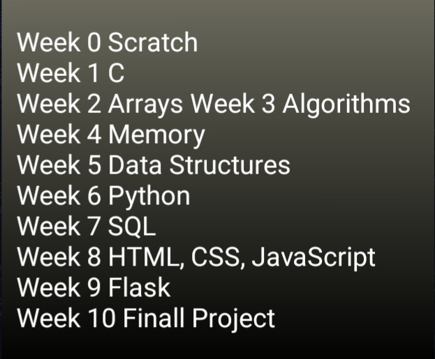
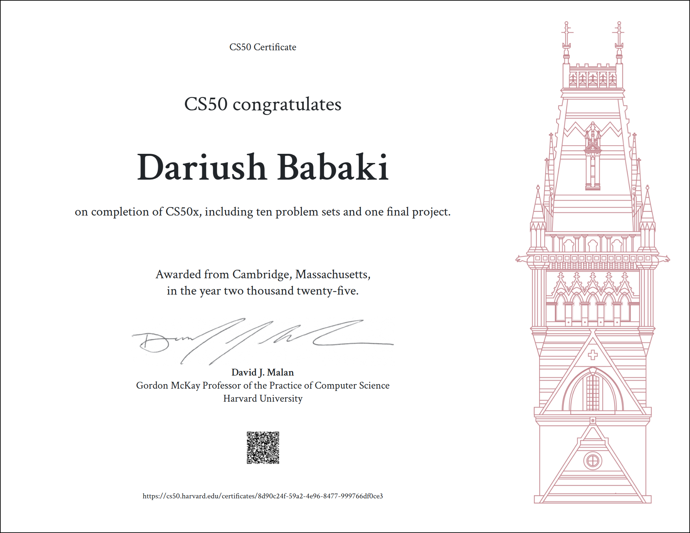

Harvard CS50X — 2025 Solutions 
=====================

-   [Course Link](https://cs50.harvard.edu/x/2025/)
-   [My Certificate](https://cs50.harvard.edu/certificates/8d90c24f-59a2-4e96-8477-999766df0ce3)
-   [Final Project](https://github.com/dariushbabaki/Problem_Sets_CS50x/tree/main/Problem%20Set%2010/Finall%20Project)

## What is it?

Introduction to Computer Science from Harvard, better known as CS50, is the largest course on the Harvard campus that are open to learners of all backgrounds looking to explore computer science, mobile app and game development, business technologies, and the art of programming.

-   ✅ Videos
-   ✅ Lab & Problem Set & Final Project
-   ✅ Slides & Notes
-   ✅ Auto Grader

## Works

This repository is used to store my solutions to weekly assignments. You can click on the folder to see a detailed description of weekly assignments and my achievement.

> A quick word on [Academic Honesty](https://cs50.harvard.edu/x/2025/honesty/). While these solutions will help you to get through the course without too much effort, you should do your best to figure out a working solution yourself before taking a look at any of my solutions. Investing your time and energy into solving the problem sets yourself is in my opinion the only way to eventual mastery.

Go ahead and take a peek at the solutions.

## Table of Contents
- [Problem Set 0: Scratch](https://github.com/dariushbabaki/Problem_Sets_CS50x/tree/main/Problem%20Set%200/Scratch)
- [Problem Set 1: C](https://github.com/dariushbabaki/Problem_Sets_CS50x/tree/main/Problem%20Set%201)
  * [Hello, world](https://github.com/dariushbabaki/Problem_Sets_CS50x/tree/main/Problem%20Set%201/Hello%2C%20World)
  * [Hello, It's Me](https://github.com/dariushbabaki/Problem_Sets_CS50x/tree/main/Problem%20Set%201/Hello%2C%20It%E2%80%99s%20Me)
  * [cash](https://github.com/dariushbabaki/Problem_Sets_CS50x/tree/main/Problem%20Set%201/Cash)
  * [credit](https://github.com/dariushbabaki/Problem_Sets_CS50x/tree/main/Problem%20Set%201/Credit)
  * [mario](https://github.com/dariushbabaki/Problem_Sets_CS50x/tree/main/Problem%20Set%201/this%20version%20of%20Mario)
    + [less](https://github.com/dariushbabaki/Problem_Sets_CS50x/tree/main/Problem%20Set%201/this%20version%20of%20Mario/mario_less)
    + [more](https://github.com/dariushbabaki/Problem_Sets_CS50x/tree/main/Problem%20Set%201/this%20version%20of%20Mario/mario_more)
- [Problem Set 2: Arrays](https://github.com/dariushbabaki/Problem_Sets_CS50x/tree/main/Problem%20Set%202)
  * [Scrabble](https://github.com/dariushbabaki/Problem_Sets_CS50x/tree/main/Problem%20Set%202/Scrabble)
  * [Caesar](https://github.com/dariushbabaki/Problem_Sets_CS50x/tree/main/Problem%20Set%202/Caesar)
  * [Readability](https://github.com/dariushbabaki/Problem_Sets_CS50x/tree/main/Problem%20Set%202/Readability)
  * [Substitution](https://github.com/dariushbabaki/Problem_Sets_CS50x/tree/main/Problem%20Set%202/Substitution)
- [Problem Set3: Algorithms](https://github.com/dariushbabaki/Problem_Sets_CS50x/tree/main/Problem%20Set%203)
  * [Sort](https://github.com/dariushbabaki/Problem_Sets_CS50x/tree/main/Problem%20Set%203/Sort)
  * [Runoff](https://github.com/dariushbabaki/Problem_Sets_CS50x/tree/main/Problem%20Set%203/Runoff)
  * [Plurality](https://github.com/dariushbabaki/Problem_Sets_CS50x/tree/main/Problem%20Set%203/Plurality)
  * [Tideman](https://github.com/dariushbabaki/Problem_Sets_CS50x/tree/main/Problem%20Set%203/Tideman)
- [Problem Set 4: Memory](https://github.com/dariushbabaki/Problem_Sets_CS50x/tree/main/Problem%20Set%204)
  * [Volume](https://github.com/dariushbabaki/Problem_Sets_CS50x/tree/main/Problem%20Set%204/Volume)
  * [Recover](https://github.com/dariushbabaki/Problem_Sets_CS50x/tree/main/Problem%20Set%204/Recover)
  * [Filter](https://github.com/dariushbabaki/Problem_Sets_CS50x/tree/main/Problem%20Set%204/this%20version%20of%20Filter)
    + [less](https://github.com/dariushbabaki/Problem_Sets_CS50x/tree/main/Problem%20Set%204/this%20version%20of%20Filter/filter_less)
    + [more](https://github.com/dariushbabaki/Problem_Sets_CS50x/tree/main/Problem%20Set%204/this%20version%20of%20Filter/filter_more)
- [Problem Set 5: Data Structures](https://github.com/dariushbabaki/Problem_Sets_CS50x/tree/main/Problem%20Set%205)
  * [Inheritance](https://github.com/dariushbabaki/Problem_Sets_CS50x/tree/main/Problem%20Set%205/Inheritance)
  * [Speller](https://github.com/dariushbabaki/Problem_Sets_CS50x/tree/main/Problem%20Set%205/Speller)
- [Problem Set 6: Python](https://github.com/dariushbabaki/Problem_Sets_CS50x/tree/main/Problem%20Set%206)
  * [Sentimental Hello](https://github.com/dariushbabaki/Problem_Sets_CS50x/tree/main/Problem%20Set%206/Hello)
  * [Sentimental Mario](https://github.com/dariushbabaki/Problem_Sets_CS50x/tree/main/Problem%20Set%206/this%20version%20of%20Mario)
    + [less](https://github.com/dariushbabaki/Problem_Sets_CS50x/tree/main/Problem%20Set%206/this%20version%20of%20Mario/mario_less)
    + [more](https://github.com/dariushbabaki/Problem_Sets_CS50x/tree/main/Problem%20Set%206/this%20version%20of%20Mario/mario-more)
  * [Sentimental Cash](https://github.com/dariushbabaki/Problem_Sets_CS50x/tree/main/Problem%20Set%206/Cash)
  * [Sentimental Credit](https://github.com/dariushbabaki/Problem_Sets_CS50x/tree/main/Problem%20Set%206/Credit)
  * [Sentimental Readability](https://github.com/dariushbabaki/Problem_Sets_CS50x/tree/main/Problem%20Set%206/Readability)
  * [DNA](https://github.com/dariushbabaki/Problem_Sets_CS50x/tree/main/Problem%20Set%206/DNA)
- [Problem Set7: SQL](https://github.com/dariushbabaki/Problem_Sets_CS50x/tree/main/Problem%20Set%207)
  * [Songs](https://github.com/dariushbabaki/Problem_Sets_CS50x/tree/main/Problem%20Set%207/Songs)
  * [Movies](https://github.com/dariushbabaki/Problem_Sets_CS50x/tree/main/Problem%20Set%207/Movies)
  * [Fiftyville](https://github.com/dariushbabaki/Problem_Sets_CS50x/tree/main/Problem%20Set%207/Fiftyville)
- [Problem Set8: HTML, CSS, JavaScript](https://github.com/dariushbabaki/Problem_Sets_CS50x/tree/main/Problem%20Set%208)
  * [Trivia](https://github.com/dariushbabaki/Problem_Sets_CS50x/tree/main/Problem%20Set%208/Trivia)
  * [Homepage](https://github.com/dariushbabaki/Problem_Sets_CS50x/tree/main/Problem%20Set%208/Homepage)
- [Problem Set9: Flask](https://github.com/dariushbabaki/Problem_Sets_CS50x/tree/main/Problem%20Set%209)
  * [Birthdays](https://github.com/dariushbabaki/Problem_Sets_CS50x/tree/main/Problem%20Set%209/Birthdays)
  * [Finance](https://github.com/dariushbabaki/Problem_Sets_CS50x/tree/main/Problem%20Set%209/Finance)
- [Problem Set10: Advanced Calculator](https://github.com/dariushbabaki/Problem_Sets_CS50x/tree/main/Problem%20Set%2010/Finall%20Project)

I finished this course on February 3, 2025.
The picture below shows my certificate after completing all the assignments:

